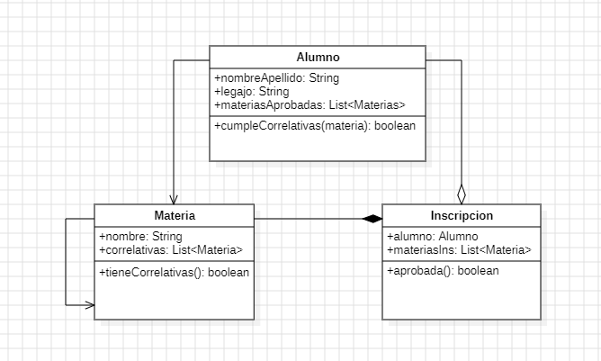

# TP1 Validador de correlatividades #
#### Bryan A. Battagliese ####

## Punto 1 ##
- Diseñar una solución en el Paradigma Orientado a Objetos y comunicar la solución mediante un Diagrama de Clases.

## Punto 2 ##
- Codificar la solución en Java.

## Punto 3 ##
- Crear los tests unitarios que considere necesario para mostrar el correcto funcionamiento del módulo.
